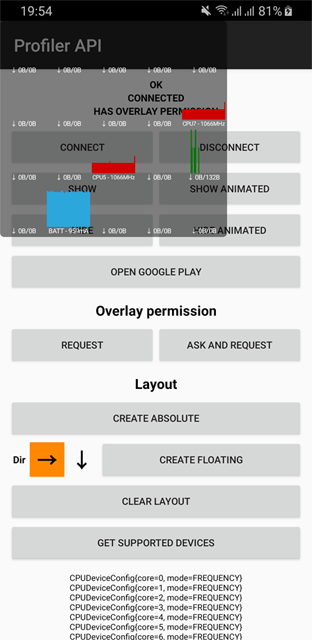
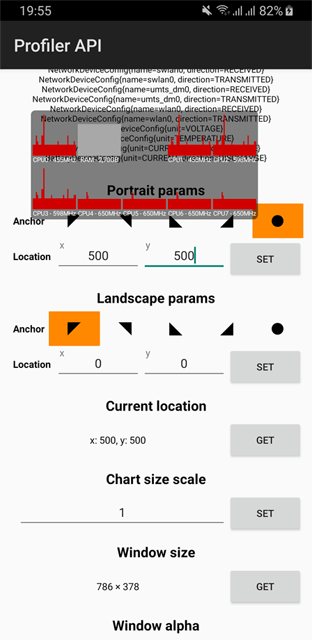
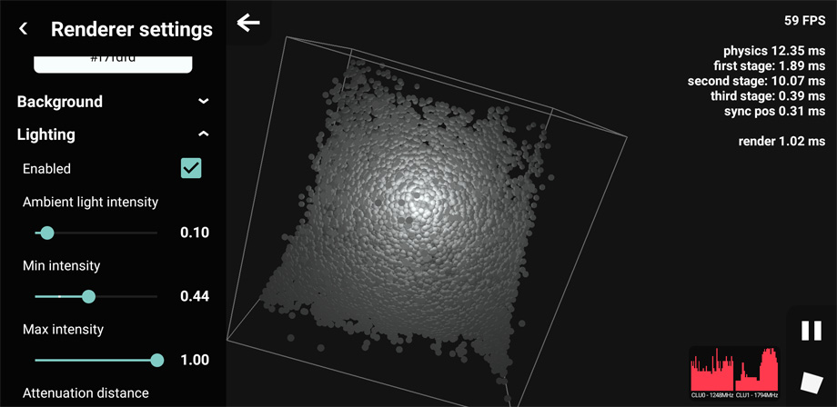
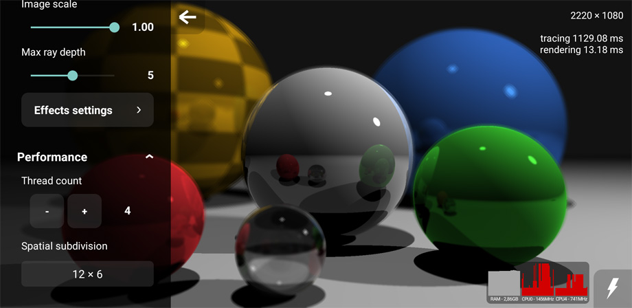

# ProfilerAPI
Lightweight API that allows integrate [Profiler](https://play.google.com/store/apps/details?id=cz.chladek.profiler) functionality into your application. Library mediates communication with the Profiler application.

#### Profiler application features
* Real-time component monitoring in floating window.
* Allows to monitor following components (depends on data provided by a device). Check compatibility list [here](https://profiler.chladektomas.eu/app/devices).
    * CPU load and frequency
    * GPU load
    * RAM usage
    * Network traffic
    * Temperature
    * Battery voltage, temperature and current

#### API allows
* built custom layout with AbsoluteLayout or FloatingLayout
* set anchor of window transitions and specific location for portrait and landscape
* set labels, formats and colors
* set window and background alpha
* set chart size

#### Sample application
The sample application uses all features allowed by the API.

**[Get it on Google Play](https://play.google.com/store/apps/details?id=cz.chladek.profiler.api.example "Google Play")**

 &nbsp;&nbsp;&nbsp;&nbsp; 

#### Real usage
Screenshots from performance intensive applications.





## Quick start

**1)** Add maven repository into root *build.gradle* file.

```gradle
maven {
    url "https://dl.bintray.com/chladektomas/maven"
}
```

**2)** Add this library as a dependency in your application's *build.gradle* file.

```gradle
dependencies {
    implementation 'cz.chladek:profiler-api:1.2.2'
}
```

**3)** Initialize Profiler, create layout and show window.

```java
final ProfilerAPI profiler = new ProfilerAPI(context);
profiler.setListener(new ProfilerEventListenerAdapter() {

    @Override
    public void onConnected() {
        DeviceConfig[] devices = profiler.getSupportedDevices();
        FloatingLayout layout = new FloatingLayout();

        CPUDeviceConfig[] cpuLoad = DeviceConfigHelper.findDevices(devices, CPUDeviceConfig.class, device -> device.getMode() == Mode.LOAD);
        GPUDeviceConfig gpu = DeviceConfigHelper.findDevice(devices, GPUDeviceConfig.class);
        RAMDeviceConfig ram = DeviceConfigHelper.findDevice(devices, RAMDeviceConfig.class);

        for (CPUDeviceConfig cpu : cpuLoad)
            layout.addDevice(cpu);

        if (gpu != null)
            layout.addDevice(gpu);

        if (ram != null)
            layout.addDevice(ram);

        layout.pack(Direction.RIGHT, 4, 3);

        profiler.setLayout(layout);
        profiler.setChartScale(0.75f);
        profiler.setWindowAnchor(Orientation.LANDSCAPE, Anchor.TOP_LEFT);
        profiler.setLocation(Orientation.LANDSCAPE, 50, 50);
        profiler.setBackgroundAlpha(0.4f);

        profiler.setVisible(true, true);
    }
});
profiler.connect();
```

**4)** Handle Activity or Fragment lifecycle. See the sample application sources for more details.

```java
@Override
protected void onResume() {
    super.onResume();
    profiler.getLifecycleHelper().onResume();
}

...
```

## Kotlin
API is fully compatible with Kotlin programming language, but written in Java to keep minimum library size.

#### Basic extensions
```kotlin
operator fun FloatingLayout.plusAssign(device: DeviceConfig?) {
    addDevice(device)
}

operator fun AbsoluteLayout.set(x: Int, y: Int, device: DeviceConfig) {
	setDevice(x, y, device)
}

fun <T : DeviceConfig> Array<DeviceConfig>.findDevice(clazz: KClass<T>): T? {
    return DeviceConfigHelper.findDevice(this, clazz.java)
}

fun <T : DeviceConfig> Array<DeviceConfig>.findDevices(clazz: KClass<T>, predicate: ((T) -> Boolean)? = null): Array<T> {
    return DeviceConfigHelper.findDevices(this, clazz.java, predicate)
}
```

#### Usage
```kotlin
val cpuLoad = devices.findDevices(CPUDeviceConfig::class) { it.mode == CPUDeviceConfig.Mode.LOAD }
val network = devices.findDevices(NetworkDeviceConfig::class)

val floatingLayout = FloatingLayout()
floatingLayout += devices.findDevice(GPUDeviceConfig::class)

val absoluteLayout = AbsoluteLayout(width, height)
absoluteLayout[0, 0] = devices.findDevice(GPUDeviceConfig::class)
```

## About
Copyright 2020 Tomas Chladek, licenced under the [Apache Licence, Version 2.0](LICENCE.txt).